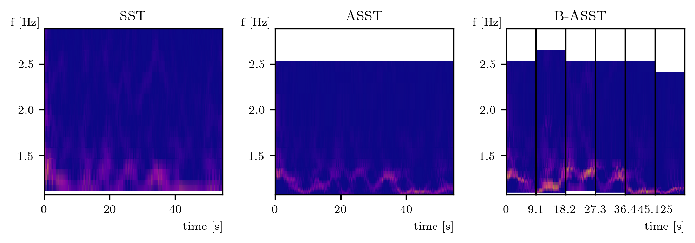

## Helper and example scripts for ```adaptivesswt```
This folder contains scripts aimed to facilitate usage of the package including selecting the adecuate parameters.

For now, some output images and tables are generated in the package [docs](../docs/) folder under ```img``` and ```latex``` respectively. This behaviour will be modified briefly in order to generate output products in the same directory from where the scripts are called. 

So far, the scripts provided are:

### [```process_data_example.py```](process_data_example.py)

This script downloads and process data from the dataset below.

The script is intended to serve as an example for usage/configuration and evaluation of this package.

Test data used from:

Shi, Kilin; Schellenberger, Sven (2019): A dataset of radar-recorded heart sounds and vital signs 
including synchronised reference sensor signals. figshare. Dataset. 
[https://doi.org/10.6084/m9.figshare.9691544.v1](https://doi.org/10.6084/m9.figshare.9691544.v1)

Data URL: [https://figshare.com/ndownloader/files/17357702](https://figshare.com/ndownloader/files/17357702)

Usage example:
```
$ python process_data_example.py -i dataset/datasets/measurement_data_person11/PCG_front_radar_front\
/PCG_2L_radar_4L/apnea/inhaled/DATASET_2017-02-16_10-56-05_Person\ 11.mat
```
It will analize radar data captured and return graphs for respiration, pulse and heart audio signals, for example:




### [```check_sswt_performance.py```](check_sswt_performance.py)
Calculates performance of the algorithm (over the running platform) in terms of samples processed per second, versus different input signal lengths and different number of parallel process.

The maximum number of parallel processes is obtained from ```multiprocessing.cpu_count() ```

It lets you verify the more performant configuration of parallelism according the length of the input signal to be processed.

### [```mse_for_synthetic_signals.py```](mse_for_synthetic_signals.py)
Calculates frequency estimation MSE of individual IMF components of a signal.
Several synthetic signals are analyzed in order to evaluate the best configuration for a particular case.
In generates several figures, and a table in latex with calculated results for each method.